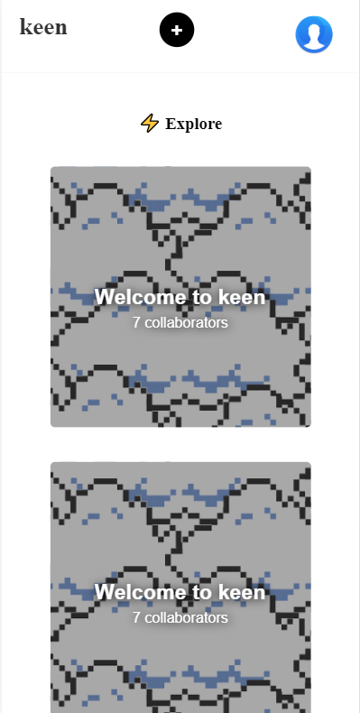
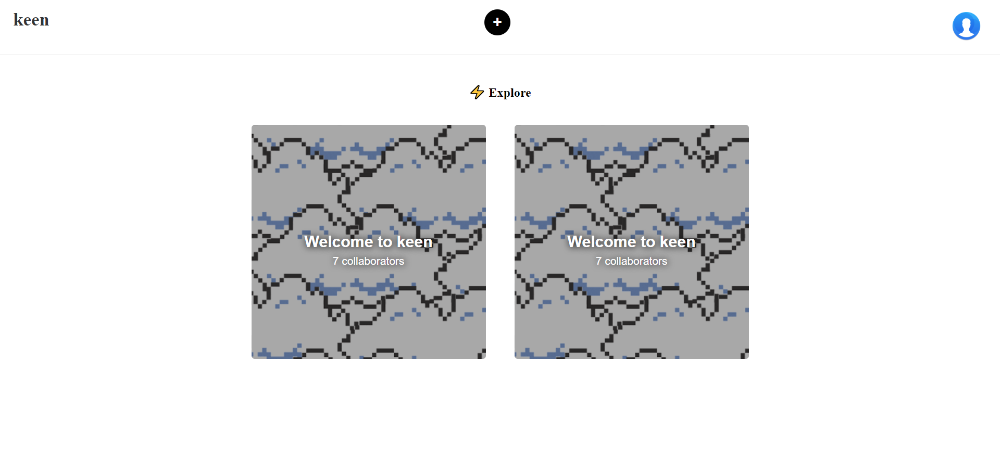

# Google Keen UI Cloned

A clone of the Google Keen application's UI for educational purposes...
  
<a href='https://aiedrow.github.io/keen/index2.html'>
<button style='padding: 15px 30px;border-radius: 9px;background:#fff;box-shadow: 1px 5px 17px -5px #dbdbbd;border: 1px solid #dbdbdb;font-weight: 666;'>
Click Here For Live Preview</button></a>

  

# Mobile Preview

This is How It Looks Like in Mobile Devices... It uses Melt CSS Framework and Google Fonts with a few Custom CSS Rules...

  

# Desktop Preview

This is How It Looks Like in Desktop Devices... It uses Melt CSS Framework and Google Fonts with a few Custom CSS Rules as well...
